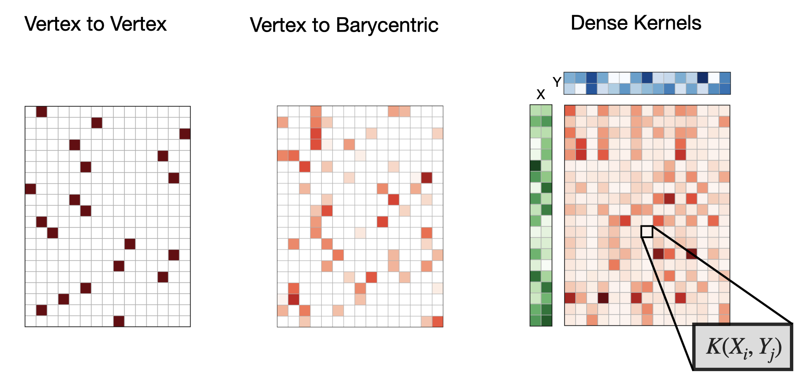

# Densemaps : Abstract Correspondence Maps for 3D Geometry

<p align="center">

</p>


[](https://robinmagnet.github.io/ScalableDenseMaps/)

Welcome to the documentation of `densemaps` !

A lightweight library that offers:
 1. Unified correspondence representation for 3D objects (surfaces, point clouds) with NumPy and PyTorch support
 2. Memory-efficient dense matrix operations for large-scale geometric maps, based on our recent research [*Memory-Scalable and Simplified Functional Map Learning*](https://arxiv.org/abs/2404.00330).

# Installing

Pip installation is not yet available.

You can clone the directory using

```bash
git clone https://github.com/RobinMagnet/ScalableDenseMaps.git
```

And install the dependencies using
```bash
pip install -r requirements.txt
```


# Shape Correspondence Representations

> **Note**: Throughout this documentation, maps $T$ go from surface $S_2$ to surface $S_1$ (not the reverse).

This library unifies three common ways to represent correspondences between 3D surfaces $S_1$ and $S_2$ (with $n_1$ and $n_2$ vertices):

 1. **Vertex-to-Vertex Maps**: Direct mapping between vertices, represented as either:
     - An array `p2p_21`$\in [0, \dots, n_1]^{n_2}$, where `p2p_21[i]` indicates which vertex in $S_1$ corresponds to vertex $i$ in $S_2$
     - A binary matrix $\Pi\in\{0,1\}^{n_2\times n_1}$ where $\Pi_{ij}=1$ means vertex $i$ maps to vertex $j$
2. **Vertex-to-Point Maps**: Maps vertices to arbitrary points on surface faces:
    - Represented by $\Pi\in[0,1]^{n_2\times nc_1}$ with $\sum_j \Pi_{ij} = 1$
    - Maximum 3 non-zero entries per row (barycentric coordinates)
    - See more details *e.g* in this [this paper](https://onlinelibrary.wiley.com/doi/full/10.1111/cgf.13254)
3. **Soft Maps**: Dense correspondence matrices:
    - $\Pi\in[0,1]^{n_2\times n_1}$ from softmax over similarity scores
    - Example: $\Pi_{ij} = \frac{\exp(S_{ij})}{\sum_j \exp(S_{ij})}$ where $S_{ij}$ measures similarity between embeddings

The common operations across all representations are:
- Converting to vertex-to-vertex maps
- Function transfer via $\Pi f$
- Map composition: $\Pi_{13}=\Pi_{12} \Pi_{23}$

The library implements these representations with both NumPy and PyTorch (CUDA-compatible) backends.

# Example Code

```python
from densemaps.torch import maps

emb1 = # Use some per-vertex embedding for object 1. (N1, p)
emb2 = # Use some per-vertex embedding for object 2. (N2, p)

P21 = maps.KernelDistMap(emb1, emb2, blur=1e-1)  # A "dense" kernel map, not used in memory

# If my embeddings were not on CUDA, I can send them easily and come back to cpu
P21.cuda()
P21.cpu()

uv1 = # Get uv-coordinates on mesh1  (N1, 2)
uv2 = P21 @ uv1  # Transfered uv coordinates (n2, 2)

P21_dense = P21._to_dense() # I can get the (N2, N1) map back

p2p_21 = P21.get_nn()  # I can get the (N2,) vertex to vertex map
```

 # Citing this work

 If you use this work, please cite

 ```bibtex
@inproceedings{magnetMemoryScalable2024,
  title = {Memory Scalable and Simplified Functional Map Learning},
  booktitle = {2024 {{IEEE}}/{{CVF Conference}} on {{Computer Vision}} and {{Pattern Recognition}} ({{CVPR}})},
  author = {Magnet, Robin and Ovsjanikov, Maks},
  year = {2024},
  publisher = {IEEE},
}
```
